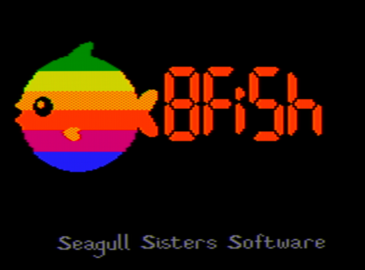
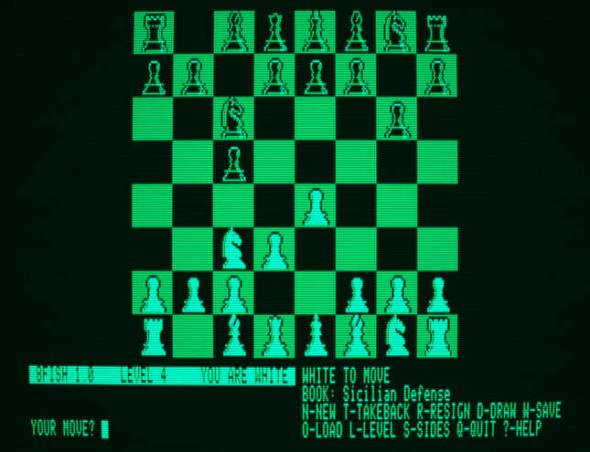

# 8fish

A chess engine for the Apple IIe. It runs on the real 1983 hardware (a 1 MHz
6502 with 128K), and the goal was for it to actually play well: to beat
anything that ran on a 1 MHz 6502 back in the day, using four decades of
chess-programming ideas the original authors didn't have yet. The name is a pun
on Stockfish.



It boots off a floppy, draws the board in double hi-res, plays from a real
opening book, and thinks on your clock while you pick your move.



## Play it

The easy way, right in your browser with nothing to install:
**[play 8fish in apple2ts](https://apple2ts.com/?machine=APPLE2EE&color=green&ghosting=on#https://raw.githubusercontent.com/zellyn/8fish/main/asm/8fish.dsk)**.
That link hands the disk image to Chris Torrence's apple2ts emulator, set up as
a 128K //e with a green screen and phosphor ghosting (about how the screenshots
above look).

Or grab [`asm/8fish.dsk`](asm/8fish.dsk) and boot it in slot 6 of a 128K Apple
IIe, real or emulated. Virtual ][, MAME, and the goapple2 core in this repo all
run it.

To move, type coordinates like `e2e4`, or drive a cursor around the board with
the arrow keys (space picks the from- and to-square, ESC backs out). The window
under the board shows the level and, while you're still in book, the opening's
name. The command keys:

`N` new game, `T` take back, `L` level, `S` switch sides, `R` resign, `D` offer
a draw, `W` save the game to disk, `O` load it back, `Q` quit, `?` help.

It thinks on your clock while it's your move, and it keeps thinking in the gaps
between your keystrokes, so poking the cursor around to study the position
doesn't throw its work away.

## How strong is it?

The bar was Sargon III, one of the stronger programs of the early Apple II
years. In a 150-game match at equal time with both sides pondering, 8fish went
**91–38–21** (wins–losses–draws), which works out to about **+128 Elo**. Every
rating in [docs/results.md](docs/results.md) comes from running the real 6502
image through a cycle-accurate emulator, not from the Go model.

One honest caveat: the margin shrinks the more time you give both sides. At
1.5× Sargon's time it's close to even. So "+128" describes a specific, fair
time control, not a blanket claim.

## Building it

You need Go and cc65 (`brew install cc65`). The dependencies (go6502, goapple2)
are ordinary Go modules; for local hacking, `go work init . ../go6502 ../goapple2`.

```
make        # assemble, run the smoke tests, build the engine, run the suite
make dsk    # build asm/8fish.dsk, the bootable floppy
```

`make dsk` also wants diskii (`go install github.com/zellyn/diskii@latest`),
which writes peterferrie's Standard Delivery boot loader. Everything is
assembled with cc65. The one exception is the vendored ProRWTS2 disk driver,
which is ACME source; its blob is committed, so you only need ACME to
regenerate it.

## How it works

The engine is hand-written 6502 assembly: negamax/PVS with late-move
reductions, null-move pruning, check extensions, a PeSTO tapered evaluation, and
a transposition table in the machine's auxiliary RAM. The whole on-screen UI
runs from Language-Card RAM and costs the engine image zero bytes.

Two hardware facts shaped most of the work. First, the IIe has no clock the CPU
can read, so time management runs on a software cycle-estimator calibrated
against the emulator; it spends its budget to within about 1%. Second, there's
no spare RAM. The opening book, the boot splash, and the save-game writer can't
all stay resident, so the book and splash stream off the disk into memory
that's dead until the search needs it (the splash is compressed and shown over
the load), and the write-capable disk driver is loaded on demand and then
discarded. The disk I/O is peterferrie's ProRWTS2.

The other half of the project is a Go test harness. A "mirror" reimplements the
search in Go as a parity twin, so an idea can be screened there, ported to
assembly, and confirmed with an SPRT match against the real image. Hundreds of
`go test` gates check everything from move legality to the exact bytes on the
double-hi-res screen. The engine binary stayed byte-for-byte identical across
the whole UI, book, and disk feature set.

More detail lives in [the plan](docs/plan.md), [decisions](docs/decisions.md),
[testing](docs/testing.md), [UI design](docs/ui-design.md), and
[the disk-driver design](docs/prorwts2-design.md).

## Status

8fish runs correctly under three emulators (goapple2, MAME, apple2ts). It hasn't
been tried on real hardware yet. That's the honest next step, especially for the
save-to-disk writes: run a save on a scratch disk and diff the image before
trusting it.

## Credits

Art and concept by Zellyn Hunter. Implementation by Claude.

It stands on a lot of other people's work: peterferrie's
[ProRWTS2](https://github.com/peterferrie/prorwts) and Standard Delivery boot
loader, [cc65](https://cc65.github.io/) and
[ACME](https://sourceforge.net/projects/acme-crossass/), the
[PeSTO](https://www.chessprogramming.org/PeSTO%27s_Evaluation_Function)
evaluation tables (Ronald Friederich), the
[lichess opening book](https://github.com/lichess-org/chess-openings) (CC0), and
[go6502](https://github.com/zellyn/go6502) /
[goapple2](https://github.com/zellyn/goapple2) /
[a2audit](https://github.com/zellyn/a2audit) /
[diskii](https://github.com/zellyn/diskii).
